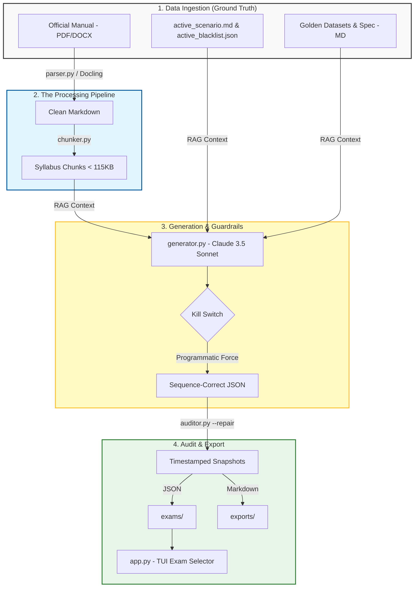

# PRINCE2 Practitioner Exam Generator

A terminal-based application designed to generate high-fidelity mock exams for the PRINCE2 7th Edition Practitioner qualification.

## Project Overview

This tool transforms a unified business scenario into a 70-mark mock exam. Retrieval-Augmented Generation (RAG) is utilized to ensure every question is grounded in the official v7 manual while mimicking the "trap-heavy" style of official PeopleCert papers.

## The Challenge of Practitioner-Level Realism

Creating a high-fidelity PRINCE2 7th Edition Practitioner exam is significantly more complex than a standard Foundation quiz. Traditional AI generation often fails because it lacks the "trap-heavy" nuance of official PeopleCert papers. Several key engineering challenges were identified and solved:

-   **1. The Cognitive Gap (Bloom's Taxonomy):** Most AI models default to "recall" questions. Practitioner exams require Bloom's Level 3 (Application) and Level 4 (Analysis).
    -   *Solution:* The generation engine explicitly bans definitions. A reasoning-based structure ("Yes, because..." / "No, because...") is forced where every option is a plausible management action, but only one is correct based on specific PRINCE2 rules.

-   **2. Knowledge Bleed & Sequence Integrity:** Large Language Models (LLMs) suffer from "knowledge bleed." If a question on *Principles* is requested, the LLM often pulls in terminology from *Processes* or *Practices* prematurely.
    -   *Solution:* **Programmatic Guardrails (The Kill Switch)** are implemented in `generator.py`. The script physically intercepts the LLM output and forcefully overwrites the `category` and `topic` fields based on the active batch, ensuring a perfect 10/9/51/30 weighting.

-   **3. Unified Narrative Grounding (Anti-Cheat):** LLMs often use provided role mappings as a "cheat sheet," leading to shallow questions that label roles directly (e.g., "The Senior User...").
    -   *Solution:* Scenario and Roles are merged into a single **Unified Narrative** (`active_scenario.md`). All PRINCE2-specific headers (Board, Assurance) and titles (Executive, Project Manager) are stripped. The LLM is forced to analyze business motivations to determine a person's functional role, restoring the "Hidden State" logic required for Practitioner difficulty.

-   **4. Mathematical Weighting & Chunking:** Feeding the entire 300-page manual to an LLM at once results in "lost-in-the-middle" hallucinations.
    -   *Solution:* **Mathematical Chunking** is utilized. The manual is sliced into 9 specific Markdown chunks under 115KB. The generator processes these individually, ensuring every question is grounded in a specific, high-resolution context window.

-   **5. The 'Matching' Format Constraint:** Official exams use complex A–E matching questions (mapping 3 actions to 5 roles).
    -   *Solution:* A **Combination Multiple-Choice** approach is utilized. Matching items are listed in the question body, and the four options (A–D) provide different mapping combinations.

## Smart Features & Syllabus Alignment

-   **Official Syllabus Weighting:** The Practitioner distribution is mathematically enforced: Principles (7), People (6), Practices (36), and Processes (21).
-   **Cognitive Dissonance Correction:** The TUI (`app.py`) dynamically intercepts rationales to replace generic phrases like "Why this is correct" with "Why Option [X] is correct," and explicitly states the correct letter upon failure.
-   **Hardened API Logic:** The generator includes a 65s cooldown between batches and robust JSON extraction to handle conversational LLM "chatter" that would otherwise break `json.loads()`.
-   **Nested Rationale Schema:** Advanced 3-part rationale (Why Correct / Why Wrong / Manual Citations) generated via strict JSON schema and formatted into clean Markdown, systematically addressing every distractor.

## 🛠️NCore Stack (v0.2-Practitioner)

- **Logic:** Python 3.14.3 + Anthropic Claude 3.5 Sonnet
- **TUI:** Textual (v0.2.0 logic for nested rationale)
- **Parser:** Docling (PDF/Docx -> Markdown)
- **Audit:** Custom Regex + JSON Blacklist (Scenario-Agnostic)

## Generation Architecture (v0.3 - Production Pipeline)

This project utilizes a **Two-Tier Validation Pipeline** to defeat LLM attention decay and enforce strict PRINCE2 Practitioner constraints.

### 1. The Generation Engine (`generator.py`)
- **Micro-Batching:** Prevents context window bloat by generating questions in focused, isolated chunks of 2–4.
- **Recency-Weighted Prompting:** Bypasses LLM "attention decay" by injecting critical constraints (Rule 2.4, Trap 9/11) and explicit GOOD/BAD contrast examples at the absolute bottom of the prompt.
- **Programmatic Kill Switch:** intercepts and normalizes common LLM typographical hallucinations (e.g., forcing standard hyphens over em-dashes) to ensure 100% downstream audit alignment.

### 2. The Hardened Auditor (`auditor.py`)
- **Deterministic Semantic Scanning:** Uses root-word regex arrays (e.g., `'decid'`, `'approv'`) to ruthlessly enforce Rule 2.4 (Definitive Management Actions), instantly failing any scenario that ends passively.
- **Logic Contradiction Traps:** Automatically flags and kills any JSON output containing contradictory option logic (e.g., "Yes, because [they failed to do the right thing]").
- **Absolute Sequence Integrity:** Refuses to compile the final Markdown exports unless the payload achieves 100% confidence (exactly 70 questions, perfectly sequenced and mapped).

### 3. The Human-in-the-Loop Semantic Check
- Python regex handles the structural math; **NotebookLM** acts as the final Lead Examiner. Small test batches are run through NotebookLM to verify distractor difficulty, logical cohesion, and granular PRINCE2 role continuity before triggering a full 70-question production run.

## Architecture & Workflow


## Interactive Exam Environment Features

- **Multi-Exam Selector:** Launching the app automatically scans for generated exams and provides a clean UI to select which dataset to load.
- **High-Fidelity Exam Simulation:** The interface is meticulously designed to mimic the actual PeopleCert proctoring environment, providing a highly realistic, distraction-free testing experience.
- **Dynamic Theme Switching:** Supports seamless toggling between a high-contrast dark mode (default) and a bright light mode to accommodate user preferences and reduce visual fatigue.
- **Comprehensive Feedback Window:** Upon submitting an answer, a dedicated modal provides immediate feedback, including the correct answer, detailed line-by-line rationales for distractors, and direct manual citations.
- **Question Bookmarking:** Users can flag specific questions during the exam using a visual bookmark toggle, allowing for easy identification and later review.
- **Customizable Exam Timer:** Features a built-in countdown clock (defaulting to 190 minutes) that can be paused, unpaused, or manually adjusted to a custom duration to suit varying study constraints.
- **Decoupled Selection Logic:** Options can be highlighted via mouse or keyboard, but require an explicit "Next" button interaction to lock and submit answers, preventing accidental clicks.
- **Unified Scenario Reference:** Dedicated modal overlay allows users to consult the project scenario, personnel profiles, and schedule at any time (`S`) without losing their place in the exam.

## Workspace Structure

| Path | Description |
|---|---|
| `data/source_manual/` | Official PRINCE2 v7 Manual (The Ground Truth). |
| `data/golden_datasets/` | Past mock exams and the Master Generation Specification ruleset. |
| `data/target_scenario/` | Unified scenario text including personnel and schedule. |
| `data/syllabus/` | Processed Markdown chunks (<115KB) used for RAG context. |
| `exams/` | Timestamped, audited JSON snapshots of generated exams. |
| `exports/` | Auto-generated, clean Markdown files of questions and answers for offline study. |
| `exam_data.json` | The active, temporary working buffer used during generation. |

---

## Setup & Installation

1. **Install Python Dependencies:**

```bash
pip install anthropic python-dotenv textual docling
```

2. **Configure API Credentials:** Create a `.env` file in the root directory:

```bash
ANTHROPIC_API_KEY=your_api_key_here
```

---

## Complete Workflow

1. **Ingest & Chunk:**

```bash
python parser.py
python chunker.py
```

2. **Generate:**

```bash
python generator.py
```

*Note: Automatically pauses for 65s on rate limits (429s).*

3. **Audit & Export:**

```bash
python auditor.py --repair
```

*Note: Repairs logic sequences, validates V0.2 nested schema, and exports to `exams/` and `exports/`.*

4. **Launch:**

```bash
python app.py
```

---

## TUI Keybinds

- **Tab**: Switch focus between Sidebar and Options
- **j / k** or **↑ / ↓**: Navigate lists / Scroll modals
- **Mouse Click**: Select answers or toggle the timer
- **t**: Open the timer configuration menu
- **p**: Pause / Unpause the exam timer
- **s**: Toggle scenario reference overlay
- **q**: Quit exam
