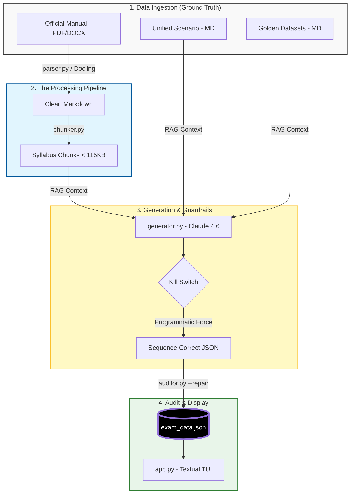

# PRINCE2 Practitioner Exam Generator

A terminal-based application designed to generate high-fidelity mock exams for the PRINCE2 7th Edition Practitioner qualification.

## Project Overview

This tool transforms a unified business scenario into a 70-mark mock exam. Retrieval-Augmented Generation (RAG) is utilized to ensure every question is grounded in the official v7 manual while mimicking the "trap-heavy" style of official PeopleCert papers.

## The Challenge of Practitioner-Level Realism

Creating a high-fidelity PRINCE2 7th Edition Practitioner exam is significantly more complex than a standard Foundation quiz. Traditional AI generation often fails because it lacks the "trap-heavy" nuance of official PeopleCert papers. Several key engineering challenges were identified and solved:

-   **1. The Cognitive Gap (Bloom's Taxonomy):** Most AI models default to "recall" questions. Practitioner exams require Bloom's Level 3 (Application) and Level 4 (Analysis).

    -   _Solution:_ The generation engine explicitly bans definitions. A reasoning-based structure ("Yes, because..." / "No, because...") is forced where every option is a plausible management action, but only one is correct based on specific PRINCE2 rules.

-   **2. Knowledge Bleed & Sequence Integrity:** Large Language Models (LLMs) suffer from "knowledge bleed." If a question on _Principles_ is requested, the LLM often pulls in terminology from _Processes_ or _Practices_ prematurely.

    -   _Solution:_ **Programmatic Guardrails (The Kill Switch)** are implemented in `generator.py`. The script physically intercepts the LLM output and forcefully overwrites the `category` and `topic` fields based on the active batch, ensuring a perfect 10/9/51/30 weighting.

-   **3. Unified Narrative Grounding (Anti-Cheat):** LLMs often use provided role mappings as a "cheat sheet," leading to shallow questions that label roles directly (e.g., "The Senior User...").

    -   _Solution:_ Scenario and Roles are merged into a single **Unified Narrative** (`Louistown_scenario.md`). All PRINCE2-specific headers (Board, Assurance) and titles (Executive, Project Manager) are stripped. The LLM is forced to analyze business motivations to determine a person's functional role, restoring the "Hidden State" logic required for Practitioner difficulty.

-   **4. Mathematical Weighting & Chunking:** Feeding the entire 300-page manual to an LLM at once results in "lost-in-the-middle" hallucinations.

    -   _Solution:_ **Mathematical Chunking** is utilized. The manual is sliced into 9 specific Markdown chunks under 115KB. The generator processes these individually, ensuring every question is grounded in a specific, high-resolution context window.

-   **5. The 'Matching' Format Constraint:** Official exams use complex A–E matching questions (mapping 3 actions to 5 roles).

    -   _Solution:_ A **Combination Multiple-Choice** approach is utilized. Matching items are listed in the question body, and the four options (A–D) provide different mapping combinations.

## Smart Features & Syllabus Alignment

-   **Official Syllabus Weighting:** The Practitioner distribution is mathematically enforced: Principles (7), People (6), Practices (36), and Processes (21).

-   **Cognitive Dissonance Correction:** The TUI (`app.py`) dynamically intercepts rationales to replace generic phrases like "Why this is correct" with "Why Option [X] is correct," and explicitly states the correct letter upon failure.

-   **Hardened API Logic:** The generator includes a 65s cooldown between batches and robust JSON extraction to handle conversational LLM "chatter" that would otherwise break `json.loads()`.

-   **Standardized Rationale Template:** 3-part rationale (Why Correct / Why Wrong / Manual Citations) formatted in clean Markdown, stripped of conversational filler.

## Interactive Exam Environment Features

-   **Native Void Aesthetic:** #000000 background with high-contrast white text to mimic standard exam proctoring environments.

-   **Decoupled Selection Logic:** Options can be highlighted via mouse or keyboard, but require an explicit "Next" button interaction to submit, preventing accidental clicks.

-   **Integrated Exam Timer:** A 190-minute countdown clock with interactive pause/unpause functionality.

-   **Unified Scenario Reference:** Access the full narrative, personnel profiles, and schedule via the `s` key without leaving the current question.

## Architecture & Workflow



## Workspace Structure

| Path | Description |
| --- | --- |
| `data/source_manual/` | Official PRINCE2 v7 Manual (The Ground Truth). |
| `data/golden_datasets/` | Past mock exams used for style transfer and trap logic. |
| `data/target_scenario/` | Unified scenario text including personnel and schedule. |
| `data/syllabus/` | Processed Markdown chunks (<115KB) used for RAG context. |
| `exam_data.json` | The compiled 70-question exam output. |

## Setup & Installation

1.  **Install Python Dependencies:**

    ```bash
    pip install anthropic python-dotenv textual docling
    ```

2.  **Configure API Credentials:** Create a `.env` file in the root directory:

    ```bash
    ANTHROPIC_API_KEY=your_api_key_here
    ```

## Complete Workflow

1.  **Ingest & Chunk:**

    ```bash
    python parser.py
    python chunker.py
    ```

2.  **Generate:**

    ```bash
    python generator.py
    ```

    _Note: Automatically pauses for 65s on rate limits (429s)._

3.  **Audit:**

    ```bash
    python auditor.py --repair
    ```

4.  **Launch:**

    ```bash
    python app.py
    ```

## TUI Keybinds

-   **Tab**: Switch focus between Sidebar and Options

-   **j / k** or **↑ / ↓**: Navigate lists / Scroll modals

-   **Mouse Click**: Select answers or toggle the timer

-   **p**: Pause / Unpause the exam timer

-   **s**: Toggle scenario reference overlay

-   **q**: Quit exam
